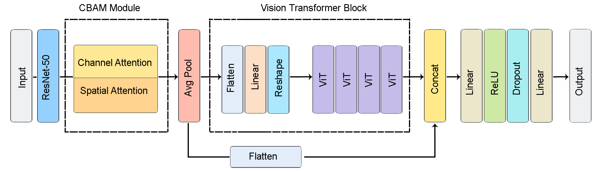

# ResNet-CBAM-ViT: A Hybrid Deep Learning Model for Robust Brain Tumor Classification in MRI using Frequency and Attention-Based.
<br><br>
This project focuses on automated classification of brain tumors from MRI scans using a hybrid deep learning architecture that combines Convolutional Neural Networks (CNNs) and Vision Transformers (ViT).
<br><br>
Our custom model architecture leverages the local feature extraction power of CNNs and the global attention capabilities of ViT to accurately classify brain tumor types into four categories:
Glioma, Meningioma, Pituitary Tumor, and No Tumor.
<br><br>
The model is trained on a preprocessed dataset of axial brain MRI images, and has shown robust performance in validation and test phases.
<br><br>

<p align="justify">
This is the official <strong>ResNet-CBAM-ViT</strong> implementation repository with PyTorch.<br/><br/>

</p>
<p align="center">
<br><br><br><br>

<br>
<b>ResNet-CBAM-ViT: Brain Tumor Classification Architecture</b>
<br><br><br><br>
</p>

## Setup
Clone the repository.

```
!git clone https://github.com/nafiuny/BrainTumorClassifier_ResNet-CBAM-ViT.git
```
```
%cd BrainTumorClassifier_ResNet-CBAM-ViT
```
```
!pip install -r requirements.txt
```
## Download dataset

```
!python download_dataset.py
```
```
!python preprocess.py --train_dir Brain_Tumor_MRI_Dataset/Training --output_dir data_preprocessed/data
!python preprocess.py --test_dir Brain_Tumor_MRI_Dataset/Testing --output_dir data_preprocessed/data

```
```
!python split_train_val.py \
    --x_path data_preprocessed/X_train_final.npy \
    --y_path data_preprocessed/y_train_final.npy \
    --output_dir data_preprocessed
```

## Train
Train BrainTumorClassifier_ResNet-CBAM-ViT.
<br/>
You can modify the values of the input parameters as per your requirements. Alternatively, you can run the script with the default settings without changing any parameters.
```
!python train.py \
    --x_train data_preprocessed/X_train.npy \
    --y_train data_preprocessed/y_train.npy \
    --x_val data_preprocessed/X_val.npy \
    --y_val data_preprocessed/y_val.npy 
```


## Test
You can easily test the trained model either with default settings or by specifying your own paths for datasets and checkpoints.<br/><br/>
```
!python test.py
```
or
```
!python test.py \
    --x_test data_preprocessed/X_test_final.npy \
    --y_test data_preprocessed/y_test_final.npy \
    --checkpoint checkpoints/model_epoch_70.pth 
```

## Single Image Prediction
To quickly predict the tumor class of a single MRI image, simply run the following command.
```
python predict.py --image_path /path/to/your/image.jpg
```

